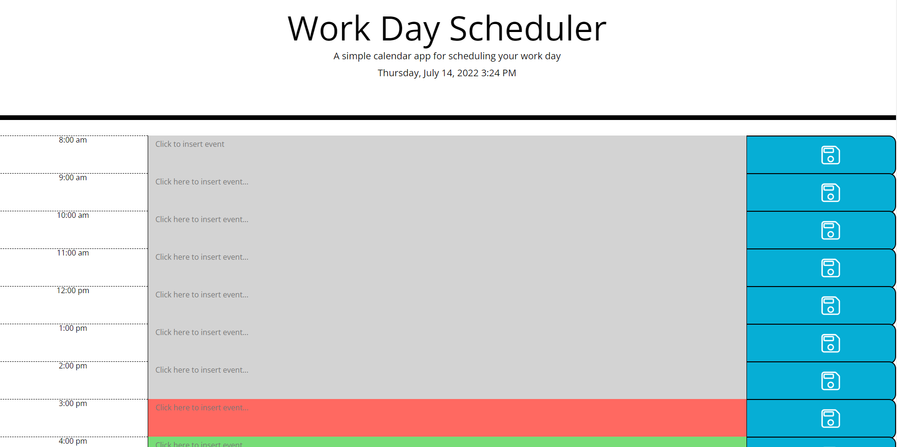
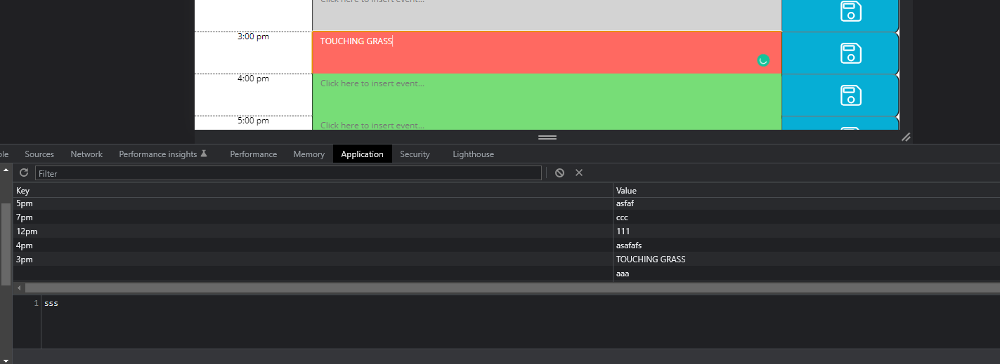

# Work Day Scheduler

A daily, user-friendly calendar that allows the user to insert their activities for each hour of the day. Such events are color-coded so that light-gray blocks represent the past, red ones are present, and green ones are the future timeblocks.

## Technologies

HTML, CSS, JavaScript, and Moment.js in order to display the current time and day on the top of the page. User is able to save their inputs to localStorage by clicking the light-blue save button.

Deployed app: https://catcueto.github.io/workday-scheduler/
